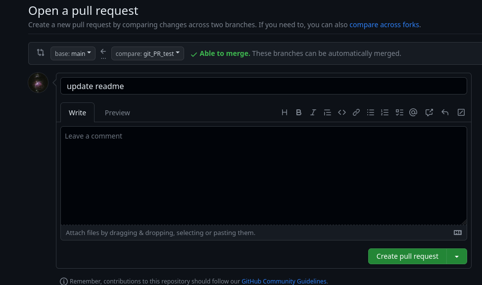
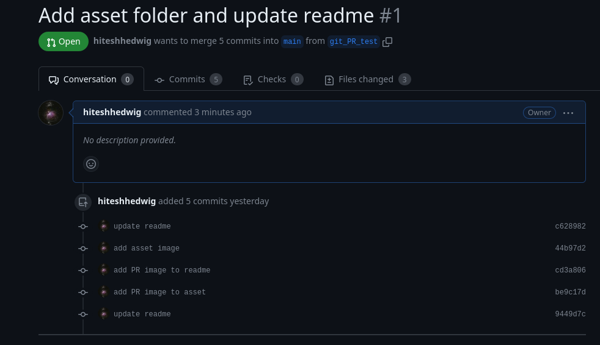

# Git basics :

Basic set of instructions to practice and learn basic to intermediate application of git in your project.

What is git? *Software which allows you to manage and keep track of your development in the project.*

- git should be installed in your system.

## Getting Started :

How to use this repo ?
- Fork it on your github account. 


and follow the instructions :

### Configure your git on your system (optional) :

for git to track your changes, it should know who made the changes.
so letting git know about us a bit helps us in future.

**username** should be your github username.
```
git config --global user.name "[name]"
```
**email** should be your email address as in github account.
```
git config --global user.email "[email address]"
```


### Clone the repo in your system :
 
since you have forked it. it should be available in your repository list too.

For you `<git repo link>` should be the one in your repository list.

```bash

git clone <git repo link>
```

### Create a new branch :
```bash

git checkout -b test_v1
```
Note : `-b` means creating a new branch.

### Add your changes :
Check this repo and you'll find `example/` folder.

I have already added sample python file `example/add.py` which adds two value. Now, create a new file in your preferred language and write a function to calculate the sum of two integers. 

git add is an alternative way of saying "code in this file is written, i'll put it in a stash folder before shipping it" 

#### See what files have changed and not tracked by git :

git status to the rescue. It will tell you what files are not tracked by git. Red colored files are not tracked and green colored files waiting to be committed.

since i'm working in master branch, you'll see git status mentioning current branch is master.

```bash
git status

On branch master
Changes not staged for commit:
  (use "git add <file>..." to update what will be committed)
  (use "git restore <file>..." to discard changes in working directory)
        modified:   Readme.md

no changes added to commit (use "git add" and/or "git commit -a")
```

Add files now :

```bash

git add example/"writefilenamehere"
```

for example : `git add example/add_csharp.cs `

you can add multiple files also like :
```bash

git add example/add_csharp.cs 
git add example/add_rust.rs
git add example/add_go.go 
```

They all will be stashed in the same folder before being sealed.

if you have created alot of new files then adding a file one by one can be little annoying. so you can just add all the files to the stash folder by saying
```bash
git add .
```


### Commit your changes made to git :

And git commit is an alternative way of saying "file which were in this stash folders are ready to be sealed." so all of the files that were in the stash folder will be given a packed under a message and sealed, they'll be tracked by the git from now.

`-m` is used to write short message in reference to the commit. Its also called commit message.

```bash

git commit -m "Add CSharp example"
```

now if you type
```bash
git log 
```
output will be like 
```bash
commit b74787e256c681776c30c6e22cf18adde6a93b22 (HEAD -> master)
Author: hiteshhedwig <hitesh.kumar61@yahoo.com>
Date:   Thu Jun 1 12:41:07 2023 +0530

    add example code
```

this commit ID `b74787e256c681776c30c6e22cf18adde6a93b22` will be tracked by git further. 

why this is helpful ? the changes you made in `N` number of files. will be saved under the commit ID incase there is something went wrong, you can open the commit and check what was the issue. This gets crucial when high number of people are working on a single project. 

in simple words, code saved was sealed with commit ID `b7478..`


### But If you forgot to add one more file to the commit :

One simple solution is to add the left over file and commit it. 

Other way would be to revert the previous commit and add the file and create a commit again.

Revert the previous commit :
```bash
git reset HEAD~
```

Add all the relevant files now.

```bash
git add .
```
Now, commit it.

```bash
git commit -m "add example code"
```

now if you type
```bash
git log 
```
output will be like 
```bash
commit f6a92f1ada97941a723b361f2f1f3bca932d4ee3 (HEAD -> master)
Author: hiteshhedwig <hitesh.kumar61@yahoo.com>
Date:   Thu Jun 1 12:59:03 2023 +0530

    add example code
```

you can notice that commit ID has changed. **Can you tell me why ?** 

### Pull Request !

what is the pull request? also widely known as PR in coding community.

avoid trying to visualize what pull request can refer to (if it doesnt make sense at the 2-3 attempts). Just simply try to understand PR is a abbreviated way of saying to the author of the repo, *"i have made some changes to fix/upgrade this package, can you merge this into relevant branch of the project?"* its upto author now if he/she wants to merge your PR (changes made) to his branch or not.

you should be in the right branch of your project.

```bash

git push origin "your-branch-name"
```
for example : `git push origin git_PR_test`

the output from terminal should look like below :

```
Enumerating objects: 5, done.
Counting objects: 100% (5/5), done.
Delta compression using up to 16 threads
Compressing objects: 100% (3/3), done.
Writing objects: 100% (3/3), 309 bytes | 309.00 KiB/s, done.
Total 3 (delta 1), reused 0 (delta 0)
remote: Resolving deltas: 100% (1/1), completed with 1 local object.
remote: 
remote: Create a pull request for 'git_PR_test' on GitHub by visiting:
remote:      https://github.com/hiteshhedwig/git_basics/pull/new/git_PR_test
remote: 
To https://github.com/hiteshhedwig/git_basics.git
 * [new branch]      git_PR_test -> git_PR_test
 ```

if you head to link provided by the terminal :

```
remote: https://github.com/hiteshhedwig/git_basics/pull/new/git_PR_test
 ```



You can fill up your PR motive and basic description in the writeup section. Then you can see the create `Pull request` widget to create a pull request.

post this: author & contributors will review your PR and evaluate. They can accept the PR or ask you to make some changes or close it depending upon the relevency of the pull request.

#### But how do i update my PR after some more commits ?

you can make your commits in the same branch that you have pushed on the github. if you push on github by using : `git push origin git_PR_test`.

and recheck your PR on the same link. It should've been updated.

Before update :


After update :


.

#### whats the deal about conflicts while merging?

if you'll ask a programmer about one thing he'll never want to see is conflicts while merging with the base branch. 

if you are wondering, what is it and whats so fuss about it ?
in simple terms, conflicts while merging increase your work by small to much. Depending upon how much you have messed up in your current branch. Reason could be anything.
1. created branch from some wrong base branch.
2. made some unnecessary changes that broke the merging.
3. or anything else

**Solution :** simple it is. personally i don't prefer using command line git to resolve conflicts. 


[this git extension](https://marketplace.visualstudio.com/items?itemName=donjayamanne.git-extension-pack) in vscode should help. Or there are many other extensions which can just make your life easy to resolve the conflicts.

but one thing is for sure, if you are face the conflicts, be very careful while resolving the conflicts because you'll have to resolve it one by one.

### Tags :


